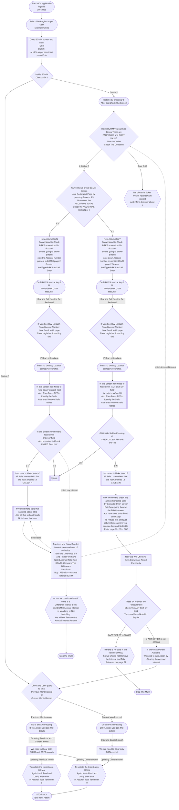

# Invalid Line Flowchart

## ! important Note After Login into MCH. Type BHDR and check The client ID if You find `EMXX`, `SVXX` or `24ZZ` Please `STOP` Immediately

```mermaid
flowchart TD
    A([Start MCH application \nlogin id: \npin+pass]) --> B([Select The Region as per User\nExample CI500])
    B --> C[[Go to BGMM screen and enter\nFund: \nCUSIP: \n at KEY as per convinent \n press Enter]]
    C --> D{Inside BGMM \n Check STA !!\n}
    D -->|Status C| E{Check the User query\n to clear \n  Previous Month record \n or\n Current Month Record}
    E -->|Previous Month record|F([ Go to BRMA by typing BRMA inside you can find details])
    E -->|Current Month record|G([Go to BRFA by typing BRFA inside you can find details])
    F -->|Browsing Previous and Current month|H[[We need to Clear both BRMA and BRFA records]]
    H -->|Updating Previous Month|J{{To update the Intrest goto MRMA \n Again it ask Fund and Cusip after enter \n In Accural: Total field enter 0 }}
    H -->|Updating Current Month|I{{To update the Intrest goto MRFA\n Again it ask Fund and Cusip after enter \nIn Accural: Total field enter 0 }}
    G -->|Browsing Current month|K[[We just need to Clear only BRFA record]]
    K -->|Updating Current Month|I
    J -->S([STOP MCH \n Take Your Action])
    I -->S
    D -->|Status 1|L([Detail it by pressing  'd'\n After that check The Screen])
    L -->M{Inside BGMM you can See Below There are\nPAR VALUE and COST VALUE \n Note the Value \nCheck The Condition}
    M -->|if 0.00 or 0|N{Currently we are at BGMM Screen\nJust Go to Next Page by pressing Enter or F5\n Note down the ACCURUAL TOTAL\nCheck the ACCURUAL field is N or Y }
    M -->|if not 0.00| A9{{We close the ticket \n we will not clear any Interest\n And inform the user about it}}
    N -->|if N|O[[Now Accurual is N\n So we Need to Check BRKP screen for this Account\n Before going to BRKP Screen\n note the Account number present in BGMM page 2 Screen \nAnd Type BRKP and Hit Enter]]
    O --> P([On BRKP Screen at Key 1 fill \n FUND and CUSIP \nHit Enter])
    P --> |Buy and Sell Need to Be Reviewed|Q{IF you See Buy Lot With Noted Accout Number\n Note Scroll to All page \nThere might be Some Buy lots }
    Q --> |IF Buy Lot Available|R([Press 'D' On Buy Lot with correct Account No.])
    R --> T[[In this Screen You Need to Note down 'Interest' field\n And Then Press PF7 to Identify the Sells \nAfter that You see Sells tables ]]
    
    T -->U{In this Screen You need to Note down\n'Interest' field \n And important is Check CXLED Field N/Y}
    U -->|if N|UU1[[Important is Make Note of All Sells Interest field that are not Canceled i.e CXLED: N \n]]

    UU1-->UU2[[if you find more sells that satisfied above step\n Add all that sell and finally Notedown  that sum]]
    UU2-->UU3[[Previous You Noted Buy lot Interest value and sum of sell value \n Take the Difference of it \n And Finnaly we have Noted Accrual Total from BGMM, Compare The Difference\n Shortform: \nBuy - AllSells == Accrual Total at BGMM]]

    UU3 -. noted sells .-> UU2
    UU3 -. noted buy interest.-> U
    UU3 -. noted Accurual interest.->  M
    UU3 --> UU4{{At last we concluded that if there is a \nDifference in Buy -Sells and BGMM Accrual interest \n is Matching or Not Matching \n We will not Remove the Accrual Interest Amount}}
    UU4 --> UU5([Stop the MCH])

  

    N --> |If Y|V[[Now Accurual is Y\n So we Need to Check BRKP screen for this Account\n Before going to BRKP Screen\n note down Account number present in BGMM page 2 Screen \nAnd Type BRKP and Hit Enter]]

    V --> W([On BRKP Screen at Key 1 fill \n FUND and CUSIP \nHit Enter])
    W -->|Buy and Sell Need to Be Reviewed|X{IF you See Buy Lot With Noted Accout Number\n Note Scroll to All page \nThere might be Some Buy lots }
    X -->|IF Buy Lot Available|Y([Press 'D' On Buy Lot with correct Account No.])
    Y --> Z[[In this Screen You Need to Note down 'ACT SET DT' field'\n i.e date in yy/mm/dd\n And Then Press PF7 to Identify the Sells \nAfter that You see Sells tables]]

    Z -->A1{GO inside Sell by Pressing 'd' \n Check CXLED 'field that are Y/N}
    A1 -->|If Y| A2[[Ignore]]
    U -->|If Y| A2
    A1 -->|If N| A3[[Important is Make Note of All Sells Lot numbers that are not Canceled i.e CXLED: N]]
    A3 -->A4[[Now we need to check this all non Canceled Sells\n by Going to BRKP screen\n But if you going thourgh the BRKP screen \n You have to re enter Fund and Cusip\n To reduce that step just return 3times where you can see Buy and Sell table \n Refer page 19 ,20 in SOP]]

    A4 --> A5[[Now We Will Check All Sells that we are Noted Previously]]
    A5 --> A6{Press 'D' to detail the Perticular sell\n Check The ACT SET DT field \nYou colud have Noted in Buy lot }
    A6 -->|if ACT SET DT is 000000|A7{{If there is No date in the field I.e 000000\nSo we Should not Remove the Interest and Take Action as per page 21}}
    A6 -->|if ACT SET DT is not 000000| A8[[If there is any Date Available \nWe need to take Action by Clearing the Accrual Interest]]
    A8 --> E
    A7 --> S2([Stop The MCH])
   
```
