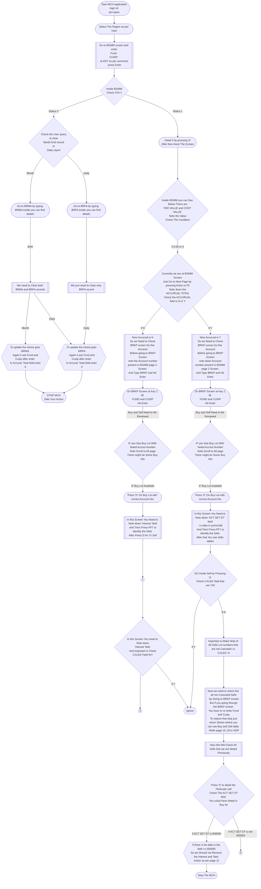

# Invalid Line Flowchart

```mermaid
flowchart TD
    A([Start MCH application \nlogin id: \npin+pass]) --> B([Select The Region as per User])
    B --> C[[Go to BGMM screen and enter\nFund: \nCUSIP: \n at KEY as per convinent \n press Enter]]
    C --> D{Inside BGMM \n Check STA !! \n}
    D -->|Status C| E{Check the User query\n to clear \n Month End record \n or\n Daily report }
    E -->|Month|F([ Go to BRMA by typing BRMA inside you can find details])
    E -->|Daily|G([Go to BRFA by typing BRFA inside you can find details])
    F -->|Both|H[[We need to Clear both BRMA and BRFA records]]
    H -->|Month|J{{To update the Intrest goto MRMA \n Again it ask Fund and Cusip after enter \n In Accural: Total field enter 0 }}
    H -->|Daily|I{{To update the Intrest goto MRFA\n Again it ask Fund and Cusip after enter \nIn Accural: Total field enter 0 }}
    G -->K[[We just need to Clear only BRFA record]]
    K -->|Daily|I
    J -->S([STOP MCH \n Take Your Action])
    I -->S
    D -->|Status 1|L([Detail it by pressing  'd'\n After that check The Screen])
    L -->M{Inside BGMM you can See Below There are\nPAR VALUE and COST VALUE \n Note the Value \nCheck The Condition}
    M -->|if 0.00 or 0|N{Currently we are at BGMM Screen\nJust Go to Next Page by pressing Enter or F5\n Note down the ACCURUAL TOTAL\nCheck the ACCURUAL field is N or Y }
   
    N -->|if N|O[[Now Accurual is N\n So we Need to Check BRKP screen for this Account\n Before going to BRKP Screen\n note the Account number present in BGMM page 2 Screen \nAnd Type BRKP and Hit Enter]]
    O --> P([On BRKP Screen at Key 1 fill \n FUND and CUSIP \nHit Enter])
    P --> |Buy and Sell Need to Be Reviewed|Q{IF you See Buy Lot With Noted Accout Number\n Note Scroll to All page \nThere might be Some Buy lots }
    Q --> |IF Buy Lot Available|R([Press 'D' On Buy Lot with correct Account No.])
    R --> T[[In this Screen You Need to Note down 'Interest' field\n And Then Press PF7 to Identify the Sells \nAfter Press D for !!!! Sell ]]
    T -->cc1((1))
    cc1 -->U{In this Screen You need to Note down\n'Interest' field \n And important is Check CXLED Field N/Y}
    U -->cc2((2))
  

    N --> |If Y|V[[Now Accurual is Y\n So we Need to Check BRKP screen for this Account\n Before going to BRKP Screen\n note down Account number present in BGMM page 2 Screen \nAnd Type BRKP and Hit Enter]]

    V --> W([On BRKP Screen at Key 1 fill \n FUND and CUSIP \nHit Enter])
    W -->|Buy and Sell Need to Be Reviewed|X{IF you See Buy Lot With Noted Accout Number\n Note Scroll to All page \nThere might be Some Buy lots }
    X -->|IF Buy Lot Available|Y([Press 'D' On Buy Lot with correct Account No.])
    Y --> Z[[In this Screen You Need to Note down 'ACT SET DT' field'\n i.e date in yy/mm/dd\n And Then Press PF7 to Identify the Sells \nAfter that You see Sells tables]]

    Z -->A1{GO inside Sell by Pressing 'd' \n Check CXLED 'field that are Y/N}
    A1 -->|If Y| A2{{Ignore}}
    U -->|If Y| A2
    A1 -->|If N| A3[[Important is Make Note of All Sells Lot numbers that are not Canceled i.e CXLED: N]]
    A3 -->A4[[Now we need to check this all non Canceled Sells\n by Going to BRKP screen\n But if you going thourgh the BRKP screen \n You have to re enter Fund and Cusip\n To reduce that step just return 3times where you can see Buy and Sell table \n Refer page 19 ,20 in SOP]]

    A4 --> A5[[Now We Will Check All Sells that we are Noted Previously]]
    A5 --> A6{Press 'D' to detail the Perticular sell\n Check The ACT SET DT field \nYou colud have Noted in Buy lot }
    A6 -->|if ACT SET DT is 000000|A7{{If there is No date in the field I.e 000000\nSo we Should not Remove the Interest and Take Action as per page 21}}
    A6 -->|if ACT SET DT is not 000000| A8((4))
    A7 --> S2([Stop The MCH])
    

```
