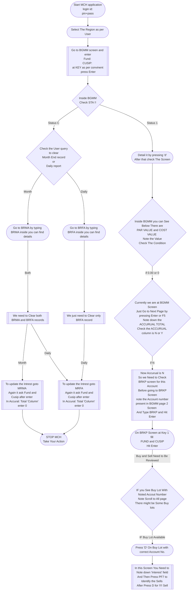

# Invalid Line Flowchart

```mermaid
flowchart TD
    A([Start MCH application \nlogin id: \npin+pass]) --> B([Select The Region as per User])
    B --> C[[Go to BGMM screen and enter\nFund: \nCUSIP: \n at KEY as per convinent \n press Enter]]
    C --> D{Inside BGMM \n Check STA !! \n}
    D -->|Status C| E{Check the User query\n to clear \n Month End record \n or\n Daily report }
    E -->|Month|F([ Go to BRMA by typing BRMA inside you can find details])
    E -->|Daily|G([Go to BRFA by typing BRFA inside you can find details])
    F -->|Both|H[[We need to Clear both BRMA and BRFA records]]
    H -->|Month|I[[To update the Intrest goto MRMA \n Again it ask Fund and Cusip after enter \n In Accural: Total 'Column' enter 0 ]]
    H -->|Daily|J[[To update the Intrest goto MRFA\n Again it ask Fund and Cusip after enter \nIn Accural: Total 'Column' enter 0 ]]
    G -->K[[We just need to Clear only BRFA record]]
    K -->|Daily|J
    J -->S([STOP MCH \n Take Your Action])
    I -->S
    D -->|Status 1|L([Detail it by pressing  'd'\n After that check The Screen])
    L -->M{Inside BGMM you can See Below There are\nPAR VALUE and COST VALUE \n Note the Value \nCheck The Condition}
    M -->|if 0.00 or 0|N{Currently we are at BGMM Screen\nJust Go to Next Page by pressing Enter or F5\n Note down the ACCURUAL TOTAL\nCheck the ACCURUAL column is N or Y }
    N -->|if N|O[[Now Accurual is N\n So we Need to Check BRKP screen for this Account\n Before going to BRKP Screen\n note the Account number present in BGMM page 2 Screen \nAnd Type BRKP and Hit Enter]]
    O --> P([On BRKP Screen at Key 1 fill \n FUND and CUSIP \nHit Enter])
    P --> |Buy and Sell Need to Be Reviewed|Q{IF you See Buy Lot With Noted Accout Number\n Note Scroll to All page \nThere might be Some Buy lots }
    Q --> |IF Buy Lot Available|R([Press 'D' On Buy Lot with correct Account No.])
    R --> T[[In this Screen You Need to Note down 'Interest' field\n And Then Press PF7 to Identify the Sells \nAfter Press D for !!!! Sell ]]


```
