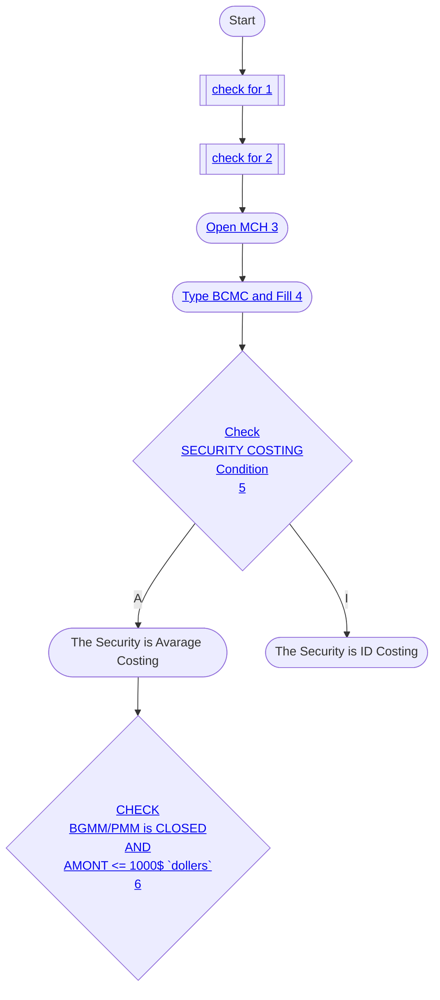

# Cost Adjustment

## Tools Required

- MCH Access
- Snow Service Request

## User Requrements

- Which `month` -> Current or Previous
- FUND == CLIENT ACCT

## Logic for cost adjustment

## Number represention for above logic steps

### 1

> ### Before Starting the application check `BHDR` for client. If the Request if for funds with client ID `EMXX`, `PBHH`, `SVXX` or `24ZZ`- Stop immediately.

### 2

> ### The request Should not be processed between `2:00 PM and 6:30 PM ET`

### 3

> ### Open `MCH` Login with Pass or PIN and Enter the Correct `Location` According to `USER`

### 4

> ### Type `BCMC` And fill At Key 1
>
> > - CLIENT ACCT:
> > - FUNCTION : b
>
> ### Press ENTER and Press `D` next to `CLIENT ACCT`

### 5

> ### Inside `BCMC` Screen you cannot see `SECURITY COSTING` Field So You need to go to `next` Page by `FWD` Button And Check The Field `SECURITY COSTING`

### 6

> ### 
