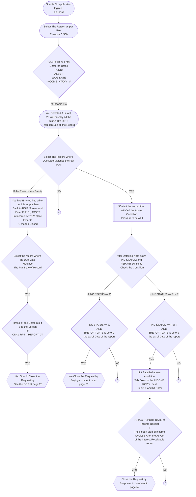

# Invalid Line removal BGIR for Flowchart

## Important note GSS can not Modify lines on `BGIR`. For This lines, GSS will `review` the Activity and `Advice The Business Group`

## ! important Note After Login into MCH. Type BHDR and check The client ID if You find `EMXX`, `SVXX` or `24ZZ` Please `STOP` Immediately

